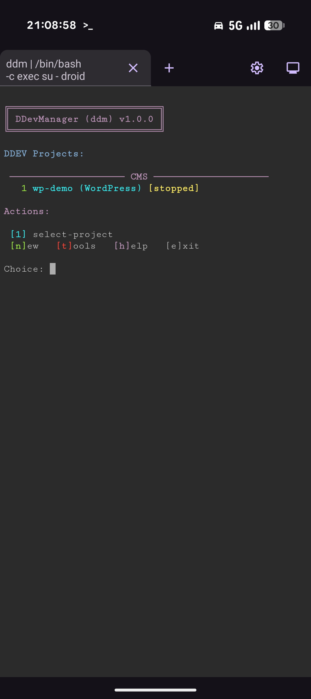
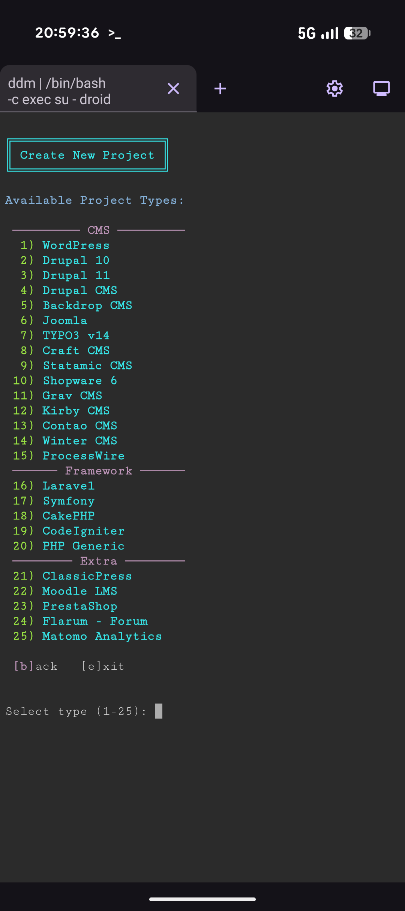
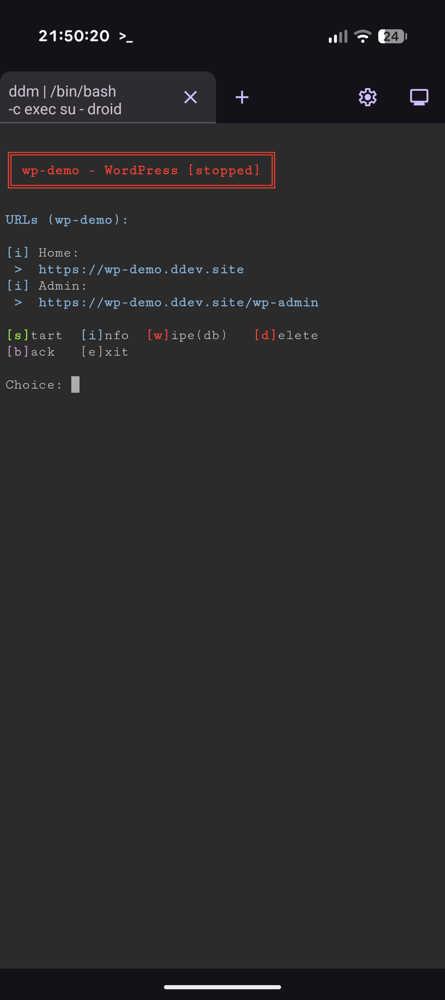
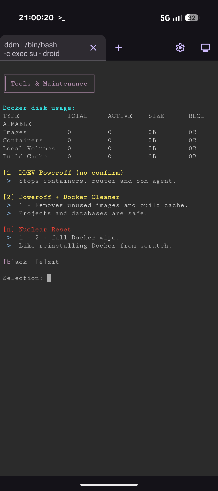
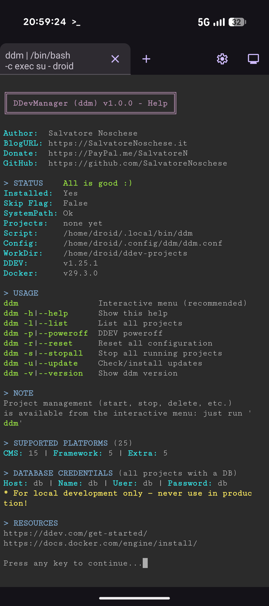

# DDEV CLI Manager (ddm)


A lightweight CLI to manage multiple DDEV projects from the terminal.

> ⚠️ Not to be confused with [DDEV Manager](https://ddev-manager.github.io/) — that's a desktop GUI. ddm is a Linux CLI tool.


**Professional DDEV project manager with one-click installations and multi-framework support**

<p align="center">
  
  
  
  
  
</p>

---

#### 📍 Quick Navigation

- **✨ [Features](#-features)**
- **🚀 [Installation](#-installation)**
- **📖 [Usage](#-usage)**
- **🎯 [Platforms](#-supported-platforms-25)**
- **🏷️ [Project Naming](#-project-naming)**
- **📊 [Database](#-database-credentials)**
- **🧹 [Tools & Maintenance](#-tools--maintenance)**
- **🔄 [Auto-Update](#-auto-update-system)**
- **🔧 [Dependency Checks](#-dependency-checks)**
- **💻 [Supported Systems](#-supported-systems)**
- **🎬 [First Run](#-first-run)**
- **🚀 [Speed Up Your Workflow](#-speed-up-your-workflow)**
- **📚 [Examples](#-examples)**
- **🩺 [Troubleshooting](#-troubleshooting)**
- **🎨 [Developer Zone](#-developer-zone)**
- **📋 [Requirements](#-requirements)**
- **📄 [License](#-license)**
- **🤝 [Contributing](#-contributing)**
- **📗 [Links](#-links)**
- **💖 [Support](#-support)**

---

### ✨ Features

- 🚀 **One-Click Installations** — Fully automated setup for 25 different platforms
- ✅ **Smart Dependency Checks** — Detects missing tools with guided install commands
- 🔄 **Auto-Update System** — Weekly checks for ddm and DDEV + manual update command
- 📦 **25 Supported Platforms** — WordPress, Drupal, Joomla, TYPO3, Laravel, Symfony, and more
- 🎨 **Interactive Menu** — Menu-driven interface with CLI utilities
- 🗄️ **DB Manager Integration** — Optional Adminer or phpMyAdmin per-project
- 🧹 **Tools & Maintenance Menu** — Docker space recovery, project management, nuclear reset
- 🎯 **Project Management** — Start, stop, restart, open, SSH, wipe-db, delete
- 💾 **Database Operations** — Wipe DB while keeping files, or full project deletion
- 🔒 **Safe Workspace** — Path validation prevents accidental operations on system directories

<p align="right"><a href="#ddevmanager-ddm">↑ Back to top</a></p>

---

### 🚀 Installation
```bash
curl -fsSL https://raw.githubusercontent.com/SalvatoreNoschese/ddm/main/ddm -o ddm && bash ddm
```
- No root required.
- On first run, ddm checks dependencies, guides setup, and offers to copy itself to `~/.local/bin` and add it to your PATH automatically.

<p align="right"><a href="#ddevmanager-ddm">↑ Back to top</a></p>

---

### 📖 Usage

#### Interactive Mode
```bash
ddm
```

The interactive menu provides:
- Project listing with status (running/stopped) grouped by category
- Visual project type indicators
- One-key actions for all operations
- Tools and maintenance menu

#### ⚡ CLI Utilities

| Command | Description |
|---------|-------------|
| `ddm` | Interactive menu (recommended) |
| `ddm -h\|--help` | Show help |
| `ddm -l\|--list` | List all projects |
| `ddm -p\|--poweroff` | DDEV poweroff |
| `ddm -r\|--reset` | Reset all configuration (asked on next run) |
| `ddm -s\|--stopall` | Stop all running projects |
| `ddm -u\|--update` | Check/install updates (ddm + DDEV) |
| `ddm -v\|--version` | Show ddm version |

> All project management (start, stop, restart, delete, SSH, etc.) is available from the interactive menu: just run `ddm`

#### `ddm -h` Status Section

The help output includes a **> STATUS** block that shows the current installation state at a glance:
```
> STATUS    All is good :)
Installed:  Yes
Skip Flag:  False
SystemPath: Ok
```

| Field | Values | Meaning |
|---|---|---|
| `Installed` | Yes / No | Whether `~/.local/bin/ddm` exists and is executable |
| `Skip Flag` | True / False | Whether setup was skipped — run `ddm -r` to reset |
| `SystemPath` | Ok / Configured / Missing | Ok = active now; Configured = in rc file, open a new terminal; Missing = not set |

If anything is wrong, the header shows a hint: `run 'ddm' to setup` or `run 'ddm -r' to fix`.

<p align="right"><a href="#ddevmanager-ddm">↑ Back to top</a></p>

---

### 🎯 Supported Platforms (25)

#### CMS (15)

| Platform | Prefix | Admin | Credentials |
|---|---|---|---|
| [WordPress](https://wordpress.org/) | `wp-` | `/wp-admin` | admin / admin |
| [Drupal 10](https://www.drupal.org/) | `dr10-` | `/user/login` | admin / admin |
| [Drupal 11](https://www.drupal.org/) | `dr11-` | `/user/login` | admin / admin |
| [Drupal CMS](https://new.drupal.org/) | `drcms-` | `/user/login` | browser install |
| [Backdrop CMS](https://backdropcms.org/) | `bd-` | `/user/login` | admin / Password123 |
| [Joomla](https://www.joomla.org/) | `joo-` | `/administrator` | admin / AdminAdmin1! |
| [TYPO3 v14](https://typo3.org/) | `t3-` | `/typo3` | admin / Demo123* |
| [Craft CMS](https://craftcms.com/) | `cf-` | `/admin` | browser install |
| [Statamic CMS](https://statamic.com/) | `st-` | `/cp` | admin@example.com / admin1234 |
| [Shopware 6](https://www.shopware.com/) | `sw-` | `/admin` | admin / shopware |
| [Grav CMS](https://getgrav.org/) | `grv-` | `/admin` | browser install (no DB) |
| [Kirby CMS](https://getkirby.com/) | `kb-` | `/panel` | browser install (no DB) |
| [Contao CMS](https://contao.org/) | `cnt-` | `/contao` | admin / Password123 |
| [Winter CMS](https://wintercms.com/) | `win-` | `/backend` | admin / admin |
| [ProcessWire](https://processwire.com/) | `pw-` | `/processwire` | browser install |

#### Framework (5)

| Platform | Prefix | Notes |
|---|---|---|
| [Laravel](https://laravel.com/) | `lrv-` | DB auto-configured in `.env` |
| [Symfony](https://symfony.com/) | `sf-` | Skeleton + webapp bundle |
| [CakePHP](https://cakephp.org/) | `cake-` | DB auto-configured |
| [CodeIgniter](https://codeigniter.com/) | `ci-` | DB auto-configured |
| [PHP Generic](https://www.php.net/) | `php-` | LAMP stack, phpinfo() starter |

#### Extra (5)

| Platform | Prefix | Admin | Notes |
|---|---|---|---|
| [ClassicPress](https://www.classicpress.net/) | `cp-` | `/wp-admin` | browser install |
| [Moodle LMS](https://moodle.org/) | `mdl-` | `/login` | admin / password |
| [PrestaShop](https://www.prestashop.com/) | `ps-` | `/admin*` | browser install (DB: db/db/db/db) |
| [Flarum](https://flarum.org/) | `flr-` | `/admin` | browser install |
| [Matomo Analytics](https://matomo.org/) | `mat-` | `/` | browser install |

<p align="right"><a href="#ddevmanager-ddm">↑ Back to top</a></p>

---

### 🏷️ Project Naming

Projects are created with a type-specific prefix to avoid conflicts:
```bash
# You enter: "myblog"
# WordPress creates: "wp-myblog"

# You enter: "api"
# Laravel creates: "lrv-api"

# You enter: "shop"
# Drupal 11 creates: "dr11-shop"
```

Enter the name **without the prefix** — ddm adds it automatically.

<p align="right"><a href="#ddevmanager-ddm">↑ Back to top</a></p>

---

### 📊 Database Credentials

All projects that use a database share standardized development credentials:

| Setting  | Value |
|----------|-------|
| DB Name  | `db`  |
| Username | `db`  |
| Password | `db`  |
| Host     | `db`  |

Each project has isolated containers. **Never use these credentials in production.**

<p align="right"><a href="#ddevmanager-ddm">↑ Back to top</a></p>

---

### 🧹 Tools & Maintenance

Access via the interactive menu → Tools:

#### [1] DDEV Poweroff
Stops all containers, the router, and the SSH agent. No confirmation required, no data lost.

#### [2] Poweroff + Docker Cleaner
Runs poweroff, then removes unused Docker images, build cache, old DDEV images, and inactive hostnames. Projects and databases are **not** affected.

#### [3] Delete All Projects
Removes all projects from the DDEV registry. Project directories remain on disk for safety. Offers snapshot save/skip choice.

#### [n] Nuclear Reset 🚨
Poweroff + Docker Cleaner + Delete All + full Docker wipe (containers, volumes, images, networks). **Destructive and irreversible** — requires explicit confirmation.

<p align="right"><a href="#ddevmanager-ddm">↑ Back to top</a></p>

---

### 🔄 Auto-Update System

ddm checks for updates to itself **and** to DDEV:

- **Automatic checks:** Every 7 days on interactive launch
- **Manual check:** `ddm -u` or `ddm --update`
- **ddm update:** Compares version string against GitHub, downloads and replaces `~/.local/bin/ddm` atomically using `install -m 755`
- **DDEV update:** Tries `ddev self-upgrade` first; falls back to the install script for script-based installations
- **Docker update:** Not managed by ddm — updates are handled by your system package manager (`apt`, `pacman`, `dnf`, etc.)
```bash
ddm -u    # Force check now
```

Update timestamp stored in: `~/.config/ddm/ddm-update-check`

> **Note:** update management requires ddm to be properly installed (`~/.local/bin/ddm` present and in PATH). If not, the option is disabled and `ddm -h` explains the current status.

<p align="right"><a href="#ddevmanager-ddm">↑ Back to top</a></p>

---

### 🔧 Dependency Checks

ddm checks for everything on startup and guides you through any missing component:

- **DDEV** — project manager
- **Docker** — container runtime (must be running and accessible)
- **jq** — JSON parsing
- **curl** — downloads and API calls
- **grep** — pattern matching
- **awk** — text processing
- **unzip** — archive extraction
- **column** — formatted list output

If Docker or DDEV is missing, ddm offers to install them automatically.

<p align="right"><a href="#ddevmanager-ddm">↑ Back to top</a></p>

---

### 💻 Supported Systems

Fully tested:
- **Arch family** (Arch, Manjaro, EndeavourOS)
- **Debian/Ubuntu family**
- **Fedora/RHEL family**

Best-effort support (guidance provided):
- Other systemd-based Linux distributions

**Not supported:** Termux.  
**Android:** Supported via proot-distro or similar full Linux environments (workspace fixed to `~/ddev-projects` for stability).

<p align="right"><a href="#ddevmanager-ddm">↑ Back to top</a></p>

---

### 🎬 First Run

On first run, ddm will:

1. Check for Docker, DDEV, and all required dependencies — installing anything missing with your confirmation
2. Run a smart PATH and install check (see below)
3. Ask for your DDEV projects directory (default: `~/ddev-projects`)
4. Ask once about DDEV telemetry
5. Save everything to `~/.config/ddm/ddm.conf`
6. Launch the interactive menu

To reset all configuration and start over: `ddm -r`

#### Smart PATH & Install Setup

On every launch from outside `~/.local/bin`, ddm checks three things:

- **Is `~/.local/bin` in your PATH?** — checks both the active session and your shell rc files (`.bashrc` / `.zshrc`)
- **Is ddm installed in `~/.local/bin`?** — checks for the file and that it is executable (`-x`)
- **Does the installed file match this one?** — compares MD5 checksums

Depending on what it finds, ddm will:

| Situation | Action |
|---|---|
| PATH missing + ddm not installed | Offer to fix both in one step |
| PATH missing + ddm installed but different | Fix PATH, then offer to replace the file |
| PATH ok + ddm not installed | Offer to install |
| PATH ok + ddm installed but different | Offer to replace (with MD5 + date + size comparison) |
| Everything ok | Silent, proceed |

If you decline the setup, ddm saves a `install_skip` flag and won't ask again. To be asked again: `ddm -r`.

**Auto-heal:** if you manually copy ddm to `~/.local/bin` and PATH is configured, the skip flag is cleared automatically on the next launch — no need to run `-r`.

<p align="right"><a href="#ddevmanager-ddm">↑ Back to top</a></p>

---

### 🚀 Speed Up Your Workflow

Useful aliases for `~/.bashrc` or `~/.zshrc`:
```bash
alias drush='ddev drush'
alias composer='ddev composer'
alias wp='ddev exec wp'
alias artisan='ddev exec php artisan'
alias bee='ddev bee'
alias typo3='ddev typo3'
```

<p align="right"><a href="#ddevmanager-ddm">↑ Back to top</a></p>

---

### 📚 Examples

#### Create a WordPress site
```bash
ddm
# Choose: New project → WordPress
# Enter name: myblog
# Creates: wp-myblog → opens in browser
# Login: admin / admin
```

#### Create a Laravel project
```bash
ddm
# Choose: New project → Laravel
# Enter name: api
# Creates: lrv-api
# Database already configured in .env
```

#### Common project operations
All project actions are available from the interactive menu.
```bash
ddm    # Launch menu, select project, then choose action
```

<p align="right"><a href="#ddevmanager-ddm">↑ Back to top</a></p>

---

### 🩺 Troubleshooting

#### Docker permission denied
ddm detects this and offers to fix it automatically:
```bash
sudo usermod -aG docker $USER
# Then log out and back in (or: newgrp docker)
```

#### Docker service not running
```bash
sudo systemctl enable --now docker
```

#### ddm not found after install

ddm handles PATH setup automatically on first run. If the command is still not found after setup:
```bash
source ~/.bashrc   # or ~/.zshrc
# Or open a new terminal — the PATH change takes effect immediately
```

If you skipped setup and want to be asked again: `./ddm -r` (or `bash ddm -r` if not executable)

#### Network/bridge errors on project start
```bash
sudo modprobe bridge && sudo modprobe veth
# Or reboot if you recently updated the kernel
```

<p align="right"><a href="#ddevmanager-ddm">↑ Back to top</a></p>

---

### 🎨 Developer Zone

Want to add a new CMS or framework? ddm is designed for easy extension.

#### How to Add a New Project Type

1. **Add an entry to `PROJECT_TYPES_CMS`, `PROJECT_TYPES_FRAMEWORK`, or `PROJECT_TYPES_EXTRA`** (format: `"key:Display Name:prefix:admin_path"`):
```bash
PROJECT_TYPES_CMS=(
  # ...
  "my-cms:My CMS:mycms:/admin"
)
```

2. **Create the install function** (name must match the key with hyphens → underscores):
```bash
install_my_cms() {
  local name="$1"
  _setup_project_dir "$name" || return 1

  _info "Configuring My CMS..."
  ddev config --project-type=php || { _error "DDEV config failed"; return 1; }
  ddev start -y || { _error "DDEV start failed"; return 1; }

  # Your installation steps here

  _finalize_installation "$name" "admin" "admin" ""
}
```

3. **Test:**
```bash
ddm
# Choose: New project — your platform will appear in the list
```

The `_finalize_installation` signature is:
```bash
_finalize_installation "$name" "username" "password" "notes" ["nodb"]
# Pass empty strings to skip credential block or notes
# Pass "nodb" as 5th argument to skip the DB manager prompt
```

<p align="right"><a href="#ddevmanager-ddm">↑ Back to top</a></p>

---

### 📋 Requirements

- **Linux** (any modern distribution)
- **Docker** with Compose v2
- **DDEV** (latest version recommended)
- **Internet connection** (for downloads and updates)

ddm checks and installs missing dependencies on startup.

<p align="right"><a href="#ddevmanager-ddm">↑ Back to top</a></p>

---

### 📄 License

MIT License — see [LICENSE](LICENSE)

<p align="right"><a href="#ddevmanager-ddm">↑ Back to top</a></p>

---

### 🤝 Contributing

The codebase is well-organized and documented. Contributions welcome via issues or pull requests on [GitHub](https://github.com/SalvatoreNoschese/ddm/issues).

<p align="right"><a href="#ddevmanager-ddm">↑ Back to top</a></p>

---

### 📗 Links

#### DDEV & Docker
- [DDEV Documentation](https://ddev.com)
- [Docker Documentation](https://docs.docker.com/)

<p align="right"><a href="#ddevmanager-ddm">↑ Back to top</a></p>

---

### 💖 Support

If you find ddm useful:
- ⭐ **Star the repository** on GitHub
- 🐛 **Report bugs** and suggest features via Issues
- 📖 **Share** with other developers
- ☕ **[Buy me a coffee](https://paypal.me/SalvatoreN)**

<p align="right"><a href="#ddevmanager-ddm">↑ Back to top</a></p>

---

**Made with ❤️ by [Salvatore Noschese](https://SalvatoreNoschese.it/ddevmanager-ddm-da-script-di-50-righe-a-tool-completo/)**
